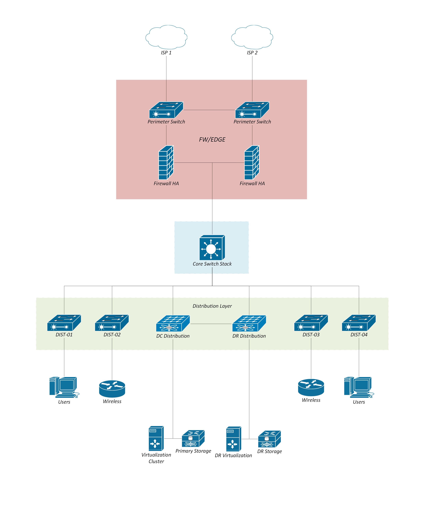

# Enterprise Network Architecture

> Sanitized enterprise network architecture documentation showcasing network hierarchy, high availability, data center infrastructure, virtualization, and disaster recovery design.

## Overview

This repository presents a sanitized and generalized representation of an enterprise IT network architecture.

The architecture demonstrates common enterprise infrastructure design principles including:

- Dual ISP connectivity
- Perimeter firewall high availability
- Core network switching
- Distribution-layer connectivity
- Data center infrastructure
- Disaster recovery infrastructure
- Virtualization
- Enterprise storage
- Wireless and user connectivity

## Architecture

The following diagram provides a high-level view of the network architecture.

> **Note:** All operational identifiers and sensitive infrastructure information have been removed or generalized for public documentation.

## Architecture Layers

### Internet / WAN

Multiple upstream connections provide external network connectivity and improve network resiliency.

### Security / Edge

A high-availability firewall architecture provides the primary security boundary between external networks and internal infrastructure.

### Core Network

The core switching layer provides high-speed connectivity between the security perimeter, distribution infrastructure, and data center environments.

### Distribution

The distribution layer provides connectivity between the core network and downstream infrastructure such as user access, wireless, and data center networks.

### Data Center

The data center infrastructure provides virtualization and enterprise storage services for internal workloads.

### Disaster Recovery

A separate disaster recovery environment is represented to support service continuity and recovery objectives.

## Design Principles

The architecture demonstrates the following design principles:

- Network hierarchy
- High availability
- Redundancy
- Infrastructure segmentation
- Centralized core connectivity
- Disaster recovery
- Separation of infrastructure roles

## Technologies

Example technologies represented by the architecture include:

- Enterprise network switching
- Firewall / security appliances
- Wireless infrastructure
- VMware virtualization
- Enterprise SAN storage
- Disaster recovery infrastructure

## Documentation

Additional technical documentation will be added as the project develops.

## Disclaimer

This repository contains a sanitized and generalized representation of an enterprise network architecture for educational and portfolio purposes.

No production credentials, IP addresses, hostnames, configuration files, secrets, or other confidential operational information are included.
